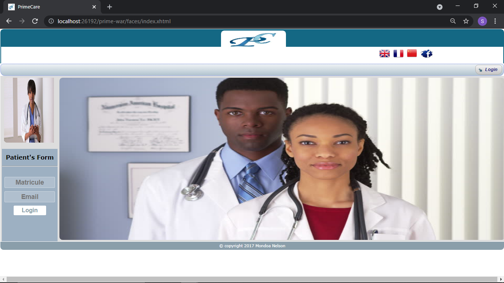

## Patients Management System

This Java Enterprise Web application was developed to focus specifically on patients management in a a hospital. It 
covers registration into the hospital, consultation, prescriptions, and anual reporting.


### System Modules

- `Ward Management`
- `Bed Management`
- `Department Management`
- `Patient Management`
- `Branch Management`
- `Consultation Management`
- `Human Resource Management`
- `Account Management`
- `Laboratory Management`


### Tools, Technologies and Languages

```http
  Languages
```
- SQL (Structure Query Language)
- Java programming language


```http
  Tools
```

- PgAdmin
- Glassfish Server
- Netbeans IDE
- Visual Paradigm
- Web Browser (google Chrome)


```http
  Technologies
```
- JAVA Enterprise Edition (JEE)
- JAVA Persistence API (JAP)
- JAVA Server Faces (JSF)
- PrimeFaces
- Postgresql


### System Functionality

- Database Setup
The database 


- Code


- Authentication




- DashBoard


- Account


- Privileges


- Medical Service


### Installation

To deploy this project, first install glassfish server, upload the .war file and click deploy, then install 
a web browser to run the project.

